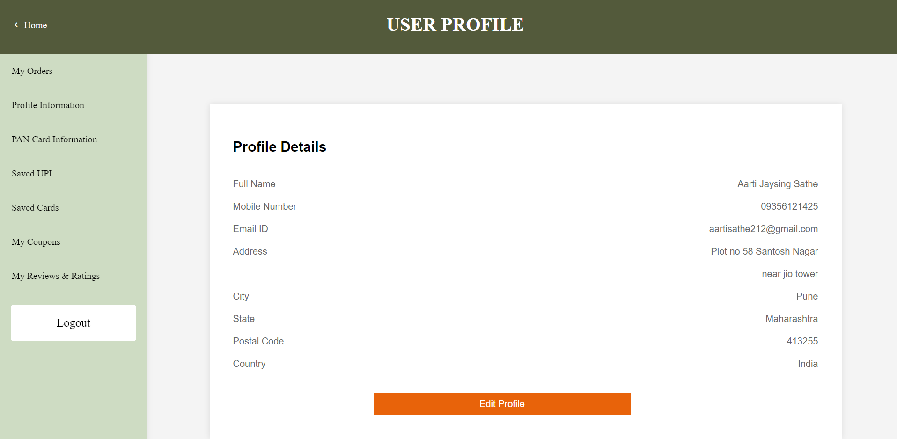

# Ecommerce_Website


This repository contains the source code and resources for an e-commerce website project. The project is built using the following technologies:  HTML: For structuring the web pages. CSS: For styling and layout of the web pages. JavaScript: For client-side scripting and interactivity. PHP: For server-side scripting and backend logic. 

## Table of Contents
1. [Project Overview](#project-overview)
2. [Admin Features](#admin-features)
3. [Customer Features](#customer-features)
4. [Technologies Used](#technologies-used)
5. [Installation](#installation)
6. [Usage](#usage)
7. [Screenshots](#screenshots)

## Project Overview

The e-commerce website allows users to browse through various products, add them to their cart, and place orders. Admin users can manage the website's content, including collections, subcollections, and products, as well as view customer information and orders.

## Admin Features

- **Login and Register**: Admin users can create an account and log in to access the admin panel.
- **Manage Collections and Subcollections**: Admins can add, view, and delete collections and subcollections.
- **Manage Products**: Admins can add new products, view existing products, and delete them.
- **View Customers**: Admins can see a list of all registered customers.
- **View Orders**: Admins can view details of all orders placed by customers.

## Customer Features

- **Login and Register**: Customers can create an account and log in to access their profile and shopping cart.
- **Explore Products**: Customers can browse through various products and collections.
- **Add to Cart**: Customers can add products to their cart and view the cart contents.
- **Remove from Cart**: Customers can remove products from their cart.
- **Place Orders**: Customers can proceed to checkout and place orders.
- **View and Edit Profile**: Customers can view and update their profile information, including delivery addresses and payment details.
- **View Order History**: Customers can view their order history and check the status of each order.

## Technologies Used

- **HTML**: Structure of the web pages.
- **CSS**: Styling of the web pages.
- **JavaScript**: Client-side scripting.
- **PHP**: Server-side scripting.
- **PhpMyAdmin**: Database management.

## Installation

1. **Clone the Repository**
   ```bash
   git clone https://github.com/your-username/ecommerce-website.git
   cd ecommerce-website
2. **Setup the Database**
   - Import the database.sql file into PhpMyAdmin to create the necessary tables and data.
3. **Configure the Database Connection**
   - Update the database connection details in the db.php file.
4. **Start the Server**
   - Use a local server environment like XAMPP, WAMP, or MAMP to run the project.

## Usage

1. **Admin Panel**
   - Access the admin panel by navigating to admin_login.html.
   - Use the admin credentials to log in and manage the website content.
2. **Customer Interface**
   - Access the customer interface by navigating to the home page.
   - Register or log in to explore products, add to cart, and place orders.
     
## Screenshots

1. **Home Page & Profile Page**
   
    
  
    
  
    
  
    
    
2. **Collections**  
  
    
  
    
    
3. **Products & Description**  
  
    
  
    
    
4. **Order & Cart**  
  
    
  
    

5. **Admin Dashboard**  
  
    
  
    
    
    
    
    

    
    
    
     
